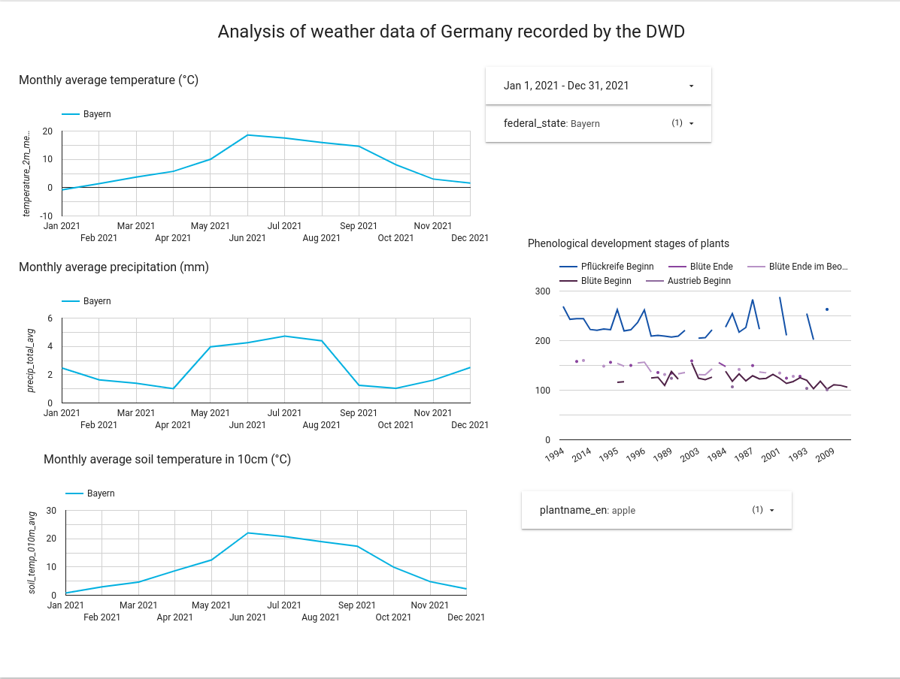

# DataTalks Club DE Zoomcamp Capstone Project by Ferdinand Kleinschroth

In this folder is the code for my project for the DataTalkClub's DE Zoomcamp Capstone Project. The dashboard can be accessed via [this link.](https://datastudio.google.com/s/mZrmQYYrLGI).

All info about the zoomcamp can be found via [this link](https://github.com/DataTalksClub/data-engineering-zoomcamp). I want to thank the team around Alexey a lot for the great zoomcamp.

## Objective:
The objective was to show the connection between the weather data and the development of plants, especially under the influence of climate change. 


## Data Sources:
All data was downloaded via the [CDC (Climate Data Center)](https://www.dwd.de/DE/klimaumwelt/cdc/cdc_node.html) of the German Weather Service (DWD) following [this link](https://opendata.dwd.de/climate_environment/CDC/).


## Tools & Tech Stack Used:
1. Infrastructure as Code: Terraform
2. Cloud Platform: Google Cloud
3. Data Lake: Google Cloud Storage
4. Data Warehouse: Google BigQuery
5. Data Transformation: dbt
6. Workflow Orchestration: Airflow
7. Containerization: Docker, Docker Compose
8. Data Vizualization Tool: Google Data Studio


## Final Analytical Dashboard:
The dashboard can be found via this [link](https://datastudio.google.com/s/mZrmQYYrLGI).



## Step-by-Step Guide:
1. Provision Cloud Infrastructure
    - Clone the repository.
    - Authenticate via gcloud, enable necessary APIs and create IAM service account as describe in [week 1](https://github.com/DataTalksClub/data-engineering-zoomcamp/blob/main/week_1_basics_n_setup) and [week 2](https://github.com/DataTalksClub/data-engineering-zoomcamp/blob/main/week_2_data_ingestion) of the Zoomcamp repository.
    - In the Terraform folder under the project directory: Enter your GCP credentials.
    - The following commands will create the infrastructure:
```terraform 
terraform init
terraform plan
terraform apply
```
2. Likewise enter the credentials in the Airflow configuration files. The following commands will run the Airflow docker container:
``` 
docker-compose build
docker-compose up
```

