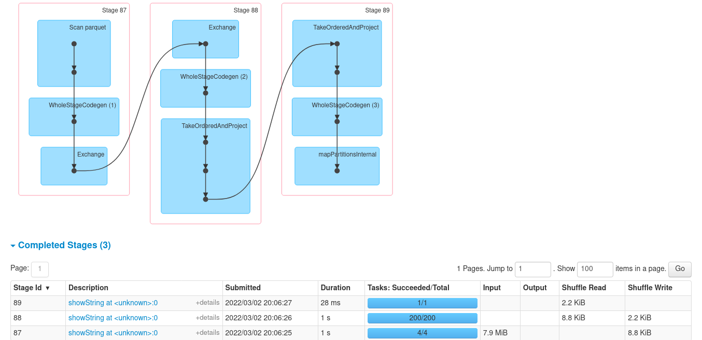

## Week 5 Homework

ferdinand.kleinschroth@gmx.de

## Question 1. Install Spark and PySpark

* Install Spark
* Run PySpark
* Create a local spark session 
* Execute `spark.version`

What's the output of `spark.version`?
```
scala> spark.version
res0: String = 3.0.3
```


## Question 2. HVFHW February 2021

What's the size of the folder with results (in MB)?
> ~ 210 MB


## Question 3. Count records 

How many taxi trips were there on February 15?
> 367170


## Question 4. Longest trip for each day

Now calculate the duration for each trip.

Trip starting on which day was the longest? 
> 2021-02-11 \
> The duration was almost 21 hours. Valid data point?


## Question 5. Most frequent `dispatching_base_num`

Now find the most frequently occurring `dispatching_base_num` 
in this dataset.
> B02510 \
> with 3233664 occurances

How many stages this spark job has?
> 3




## Question 6. Most common locations pair

Find the most common pickup-dropoff pair. 

>   East New York (76) / East New York (76) \
> Average trip duration: 522 seconds


## Bonus question. Join type


For finding the answer to Q6, you'll need to perform a join.

What type of join is it?

> LEFT OUTER JOIN

And how many stages your spark job has?

> 3 stages

